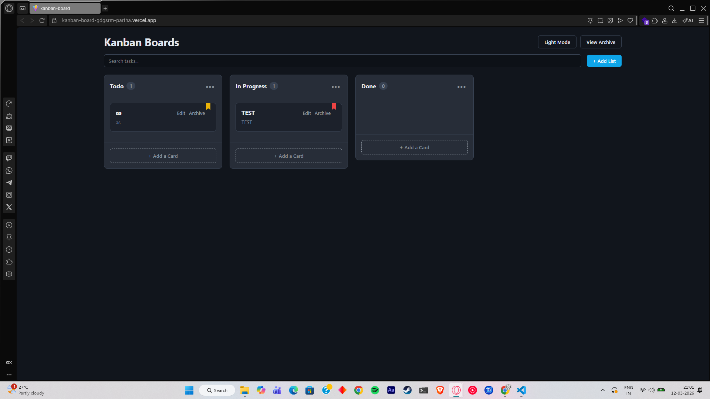

# Enterprise Kanban Board

A modern, highly interactive Kanban board built with React and Vite. Designed with a clean, professional interface, it allows users to manage tasks, create dynamic workflows, and maintain productivity without missing a beat. All data is persisted locally so you never lose your progress.

## Screenshots



*Above: The main board view featuring Dark Mode and custom priority labels.*

## Features

* **Seamless Drag & Drop:** Smooth, flicker-free drag-and-drop interactions. Cards automatically "make space" for the dragged item to show exactly where it will land.
* **Dynamic List Management:** * Create new lists on the fly.
    * Rename, Copy, or Delete entire lists.
    * Sort lists alphabetically or by Task Priority.
* **Advanced Task Handling:**
    * Inline card creation with Title, Description, and Priority settings (Low, Medium, High).
    * Color-coded priority bookmarks on every card.
    * Edit existing tasks or move them to the Archive.
* **Archive System:** A dedicated slide-out panel to view and restore archived tasks, keeping your active board clutter-free.
* **Theme Toggle:** Beautiful, high-contrast Dark Mode and crisp Light Mode.
* **Search & Filter:** Instantly filter your board to find specific tasks.
* **State Persistence:** Everything is automatically saved to your browser's `localStorage`.

## Tech Stack

* **Frontend Framework:** React (via Vite for lightning-fast HMR)
* **Styling:** Pure CSS with CSS Variables for dynamic theming
* **State Management:** React Hooks (`useState`, `useEffect`)
* **Drag & Drop:** Native HTML5 Drag and Drop API

## Local Setup & Installation

To run this project locally on your machine, follow these steps:

1. **Clone the repository** (if you haven't already):
   ```bash
   git clone [https://github.com/yourusername/kanban-board.git](https://github.com/yourusername/kanban-board.git)
   cd kanban-board
